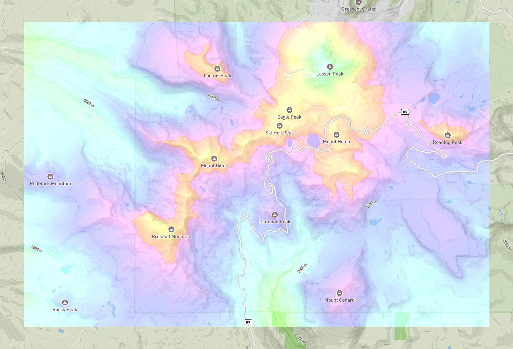

# Backcountry Almanac

This is a React app that uses Mapbox GL JS to create an interactive map of an area with custom WebGL layers for visualization. It uses DEM data (downloaded from https://apps.nationalmap.gov/downloader/) of a small area around Lassen National Park. The raw data is parsed using https://github.com/geotiffjs/geotiff.js/. This elevation data is then piped into custom WebGL shaders that form the basis of each visualization layer.

Here is the map showing an elevation visualization. Note that due to the difference between the Mercator projection used by Mapbox and the UTM projection used by the DEM data, the grid is stretched vertically. I plan to fix this when I make the grid size dynamic.

The goal is to be able to show information about current conditions to help estimate when a refrozen slope may soften and offer good skiing, or even when a slope covered in powder can be expected to warm up and start avalanching. Specifically the goal is to create layers that display Solar Exposure (boolean), Solar Irradiance (W/m2), and Insolation (Wh/m2).

Longer term, integrating weather data could be interesting as well (ex to help account for the wind/cloud cover/temperature's impact on the snowpack), but for now I'm assuming clear skies (and thus 100% solar irradiance).

At the end of the day, this is a for-fun personal project :)
