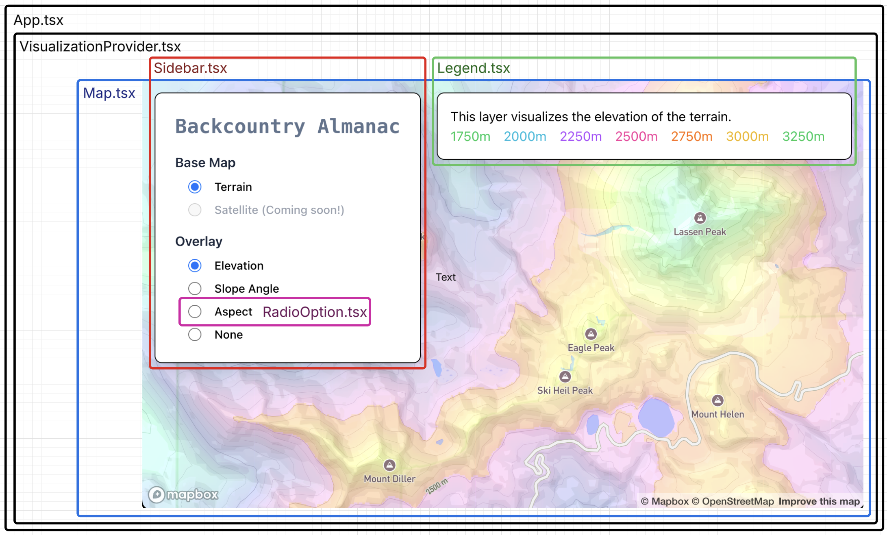
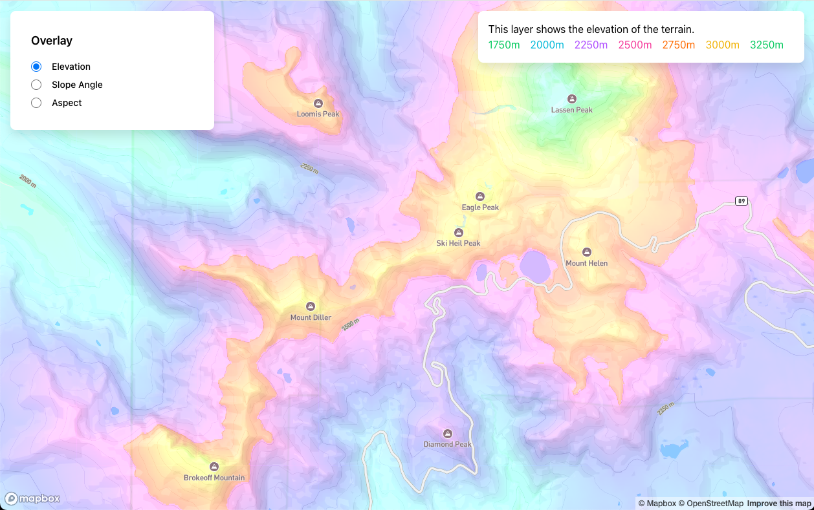
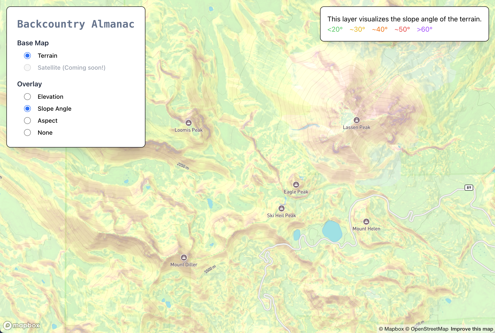
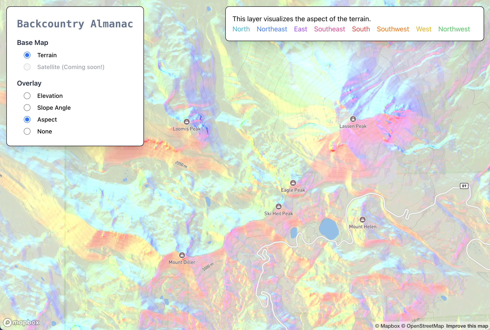
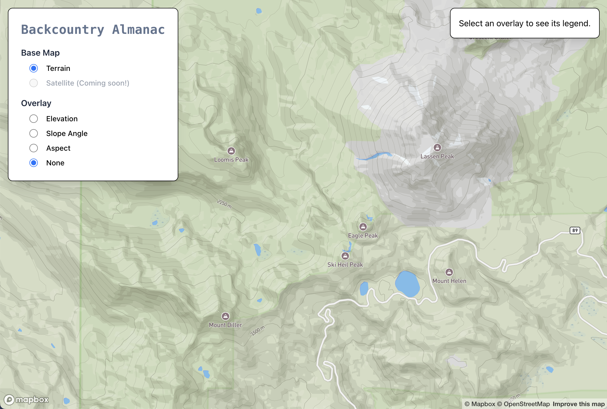

# Backcountry Almanac

## Goals

The goal of this project is first and foremost to learn. The 'modern' web framework I used at my last job (LWC) was introduced in February 2019, and was touted as being comparable to React's class based components... which were superseded by React's function based components later that same month. I want to modernize my web development skills.

The secondary goal of this project is to build an interactive terrain visualizer that would be useful to someone planning a backcountry ski trip. I'd like to create custom layers that other mapping apps do not have, such as Solar Exposure (boolean), Irradiance (W/m2), and Insolation (Wh/m2) for a user-specified date & time. Solar exposure, irradiance & insolation are tricky because (in addition to calculating the sun's position in the sky for given GPS coordinates) one needs to take into account shadows cast by surrounding terrain. These layers would provide information that could be used to estimate when a refrozen slope may soften and offer good skiing, or when a slope covered in fresh powder can be expected to warm up and start avalanching.

To get started, I am building simpler layers, such as elevation, aspect, and slope angle. Longer term, integrating weather data could be interesting as well, to help account for the wind, cloud cover & temperature's impact on the snowpack.

## Technical Overview

This project is a modern web application built using the following tools, frameworks and libraries:

### Frontend
- **Vite**: Build tool and development server
- **React 18**
- **TypeScript 5**
- **Tailwind CSS**

### Map Visualization
- **Mapbox GL JS**: Interactive map with WebGL acceleration
- **Custom WebGL Shaders**: GPU accelerated terrain visualization

### Data Sources + Management
- **[USGS National Map](https://apps.nationalmap.gov/downloader/)**: Provides high-resolution DEM data of the United States, downloadable as a `.tif`. I haven't built anything to dynamically load DEM data from the backend. It is just a single static asset stored on disc (for now...)
- **[geotiff.js](https://github.com/geotiffjs/geotiff.js/)**: Library used to parse and process Digital Elevation Model (DEM) data

### State Management
- React Context API: For state management (no Redux... yet)

**NOTE:** Before this project, I had minimal experience with Mapbox, React, Typescript or Tailwind and no experience with processing DEM data or writing WebGL shaders.

## Component Overview

The component hierarchy is straightforward:

These are all presentational components except for `VisualizationProvider.tsx`, which is a container component that manages which visualization type is active. `Sidebar.tsx`, `Map.tsx` and `Legend.tsx` all consume the `VisualizationContext`.

## Screenshots

Here is the map showing the elevation overlay:

Here is the map showing the slope angle overlay:

Here is the map showing the aspect overlay:

And here is the base map, with no overlay:

## To-Dos:

    [✔] Add todo tracker to README so that folks looking at the repo will see it
    [ ] Continue to cleanup code - add inline todos for bigger items. Now that things have stabilized a bit, add thorough high level comments
    [ ] Create thorough documentation
    [ ] Add unit tests (try vitest or default to regular jest)
    [ ] Set up eslint for consistent code formatting
    [ ] Pull 'card' styling into a wrapper component to be shared by Sidebar.tsx and Legend.tsx
    [ ] Create 'SettingsGroup' component to avoid duplicated divs in Sidebar.tsx
    [ ] Add support for satellite basemap
    [ ] Fix bug where with quick repeated clicks, the displayed layer doesn't match the selected radio option
